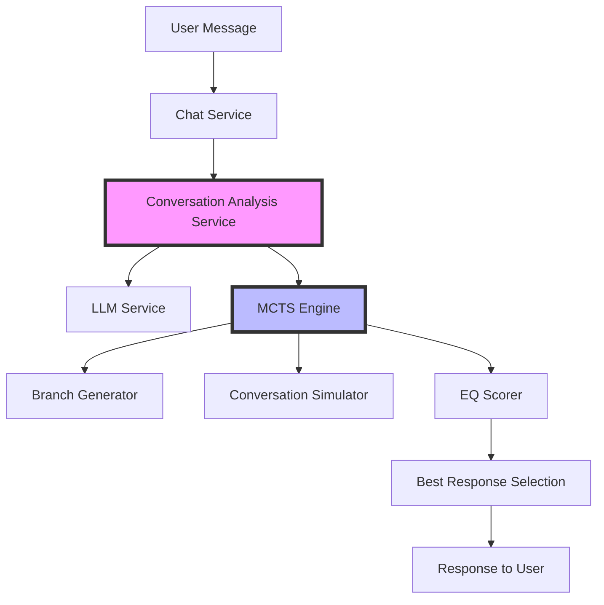
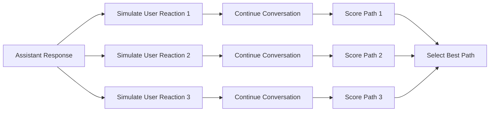
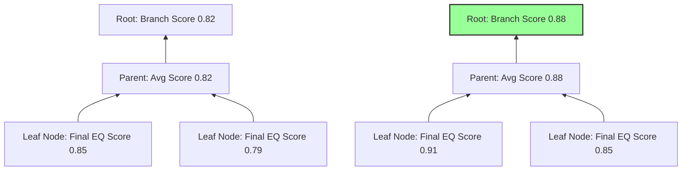
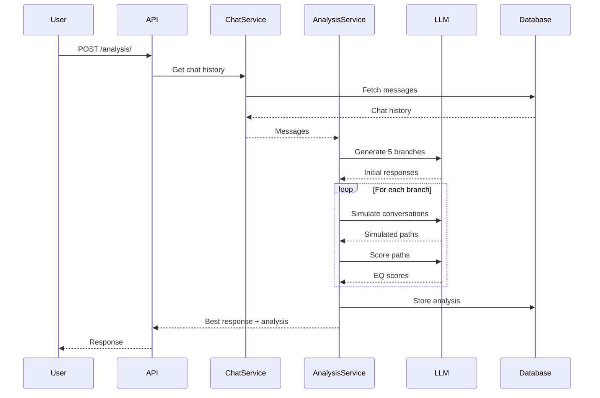

# Conversational Analysis Engine (CAE)
## Using Monte Carlo Tree Search for High-EQ Conversations

---

## Table of Contents

1. [Introduction & Overview](#introduction--overview)
2. [Core Concepts: MCTS in Conversational AI](#core-concepts-mcts-in-conversational-ai)
3. [The CAE Architecture](#the-cae-architecture)
4. [MCTS Implementation Details](#mcts-implementation-details)
5. [EQ Scoring System](#eq-scoring-system)
6. [Simulation & Rollout Process](#simulation--rollout-process)
7. [Backpropagation in CAE](#backpropagation-in-cae)
8. [Selection Strategy](#selection-strategy)
9. [API Workflow](#api-workflow)
10. [Benefits & Use Cases](#benefits--use-cases)

---

## Introduction & Overview

### What is CAE?

The **Conversational Analysis Engine (CAE)** is an AI-powered system that uses Monte Carlo Tree Search (MCTS) to find the most emotionally intelligent response paths in conversations.

### Key Features

- **Multiple Response Generation**: Explores 5 different conversation branches
- **Deep Simulation**: Simulates conversation continuations up to 3 turns ahead
- **EQ-Based Scoring**: Evaluates responses on 8 emotional intelligence factors
- **Intelligent Selection**: Chooses the response with the highest potential for positive engagement

### Why MCTS for Conversations?

Traditional chatbots respond reactively. CAE thinks ahead, considering:
- How users might react to different responses
- Long-term conversation outcomes
- Emotional dynamics and rapport building

---

## Core Concepts: MCTS in Conversational AI

### Traditional MCTS vs Conversational MCTS

| Traditional MCTS (Games) | Conversational MCTS (CAE) |
|-------------------------|---------------------------|
| Fixed game states | Dynamic conversation states |
| Win/lose outcomes | EQ scores (continuous) |
| Deterministic rules | Probabilistic user reactions |
| Perfect information | Uncertain emotional states |

### The Four Phases of MCTS in CAE

1. **Selection**: Generate diverse initial response options
2. **Expansion**: Create conversation branches
3. **Simulation**: Project future conversation turns
4. **Backpropagation**: Update scores based on outcomes

### Adapting MCTS for Conversations

```
Traditional: Game Tree → Move Selection → Win/Loss
CAE:         Conversation Tree → Response Selection → EQ Score
```

---

## The CAE Architecture

### System Components



### Database Schema

- **Users**: Track conversation participants
- **Chats**: Conversation sessions
- **Messages**: Individual messages with embeddings
- **Analyses**: Stored MCTS analysis results with branches and scores

---

## MCTS Implementation Details

### Phase 1: Initial Branch Generation

```python
# From conversation_analysis_service.py
async def _generate_initial_branches(self, messages, num_branches=5):
    """
    Generate diverse response options demonstrating different EQ aspects:
    1. Empathetic understanding
    2. Active listening and validation
    3. Thoughtful questioning
    4. Supportive encouragement
    5. Balanced perspective offering
    """
```

### Phase 2: Branch Exploration

For each initial response:
1. Add response to conversation history
2. Generate 3 possible user reactions
3. Simulate conversation continuation for `simulation_depth` turns
4. Score each simulation path

### Phase 3: Parallel Processing

```python
# Process all branches simultaneously for efficiency
tasks = [
    self._evaluate_branch(base_messages, branch, simulation_depth, idx)
    for idx, branch in enumerate(initial_branches)
]
scored_branches = await asyncio.gather(*tasks)
```

---

## EQ Scoring System

### Eight Dimensions of Emotional Intelligence

Each conversation branch is scored on a 0-1 scale across:

| Dimension | Description | Weight |
|-----------|-------------|---------|
| **Empathy** | Understanding and acknowledging emotions | High |
| **Active Listening** | Showing the speaker was heard | High |
| **Emotional Awareness** | Recognizing emotional cues | Medium |
| **Supportiveness** | Providing appropriate support | Medium |
| **Engagement Quality** | Fostering continued dialogue | High |
| **Conflict Resolution** | Navigating tensions constructively | Medium |
| **Authenticity** | Natural communication style | Medium |
| **Growth Facilitation** | Helping others develop | Low |

### Scoring Formula

```
Overall EQ Score = Weighted Average of All Dimensions
Best Path = max(branch.eq_score for branch in branches)
```

---

## Simulation & Rollout Process

### Conversation Simulation Flow



### Simulation Depth

- **Default**: 3 turns ahead
- **Each turn**: User response → Assistant response
- **Total simulations**: 5 branches × 3 user reactions = 15 paths

### Example Simulation

```json
{
  "original_response": "I understand you're feeling frustrated...",
  "simulated_reactions": [
    "Yes, exactly! It's been really hard lately.",
    "I don't think you really understand.",
    "Thanks for listening, I needed to vent."
  ],
  "continuation_paths": [...]
}
```

---

## Backpropagation in CAE

### Traditional MCTS Backpropagation

In games: Propagate win/loss up the tree to update node statistics

### CAE's Approach to Backpropagation

Instead of win/loss, CAE propagates **EQ scores**:



### Score Aggregation

1. **Leaf Level**: Individual simulation scores
2. **Branch Level**: Average of all simulations for that branch
3. **Selection Level**: Compare all branch scores

### Key Differences from Game MCTS

- No visit counts (each branch explored equally)
- No UCB formula (exhaustive exploration of fixed branches)
- Scores represent quality, not probability of winning

---

## Selection Strategy

### Branch Selection Process

```python
# From conversation_analysis_service.py
async def _select_best_branch(self, branches, original_messages):
    # Sort branches by EQ score
    indexed_branches = [(i, b) for i, b in enumerate(branches)]
    indexed_branches.sort(key=lambda x: x[1].eq_score, reverse=True)
    
    best_idx = indexed_branches[0][0]
    
    # Generate detailed analysis of why this path was chosen
    analysis = await self._generate_selection_analysis(
        selected_branch=branches[best_idx],
        all_branches=branches,
        conversation_context=original_messages
    )
```

### Selection Criteria

1. **Primary**: Highest overall EQ score
2. **Secondary**: Consistency across sub-dimensions
3. **Tertiary**: Positive user engagement probability

### Analysis Generation

The system provides detailed reasoning for its selection:
- Emotional dynamics at play
- Specific EQ factors demonstrated
- Potential positive outcomes
- Risks avoided

---

## API Workflow

### Complete Request Flow



### Performance Optimization

- **Parallel Processing**: All branches evaluated simultaneously
- **Async Operations**: Non-blocking LLM calls
- **Timeout Handling**: 10-minute timeout for complex conversations

---

## Benefits & Use Cases

### Key Benefits

1. **Improved Conversation Quality**
   - Higher user satisfaction
   - Better emotional connection
   - Reduced misunderstandings

2. **Predictive Insights**
   - Anticipate user reactions
   - Avoid conversation pitfalls
   - Build stronger rapport

3. **Measurable EQ Metrics**
   - Track conversation quality
   - Identify improvement areas
   - A/B test responses

### Use Cases

- **Customer Support**: Handle difficult conversations with empathy
- **Mental Health Apps**: Provide supportive, thoughtful responses
- **Educational Tutoring**: Adapt to student emotional states
- **Social Companions**: Build meaningful connections
- **Conflict Resolution**: Navigate tense situations constructively

### Future Enhancements

- **Personalization**: User-specific EQ preferences
- **Real-time Adaptation**: Adjust strategy mid-conversation
- **Multi-cultural EQ**: Culture-aware emotional intelligence
- **Group Conversations**: MCTS for multi-party dialogues

---

## Summary

### CAE's Unique Approach

The Conversational Analysis Engine represents a paradigm shift in conversational AI:

- **From Reactive to Predictive**: Think ahead, not just respond
- **From Functional to Emotional**: Prioritize EQ over task completion
- **From Single-shot to Strategic**: Consider long-term conversation health

### Technical Innovation

- First production use of MCTS for conversation planning
- Novel EQ scoring system for response evaluation
- Efficient parallel branch exploration
- Comprehensive analysis and explainability

### Impact

By combining MCTS with emotional intelligence scoring, CAE enables AI systems to have more meaningful, empathetic, and effective conversations that build genuine rapport with users.