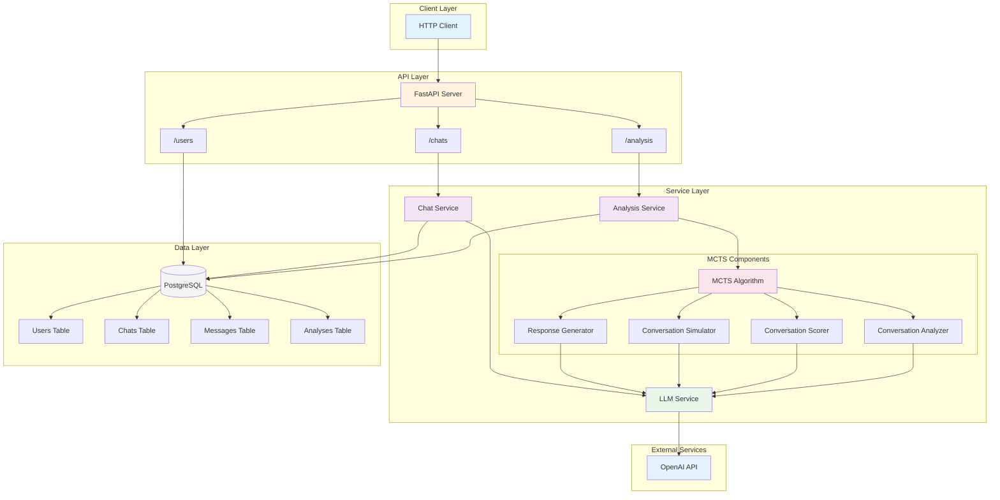

# Conversational Analysis Engine (CAE)


## Project Goal

The core idea behind this project is to move beyond static, single-turn training data for language models. Real-world conversation is a dynamic, branching tree of possibilities, where each response can lead to a different outcome. Standard instruction-response datasets don't capture this complexity.

The Conversational Analysis Engine (CAE) addresses this by simulating these conversation trees. It explores different response paths to find the most optimal one based on a defined goal. The data generated from these simulations can be used to create rich, RL-friendly datasets that show *why* a certain conversational path is better than another, which is ideal for training methods like PPO.

## Our Approach: Combining LLMs and MCTS

Our approach is to combine the generative power of LLMs with the strategic planning of classical algorithms. Specifically, this project uses a Monte Carlo Tree Search (MCTS) algorithm—similar to the one used by AlphaGo—to explore the vast space of possible conversations.

LLMs are excellent at generating contextually relevant and human-like responses. However, they don't inherently optimize for long-term conversational goals. By pairing an LLM with MCTS, the system can look ahead, simulate future turns, and choose responses that lead to better long-term outcomes, rather than just picking the most probable next response.

## A Dual-Purpose System: Chat API + Analysis Engine

CAE is a dual-purpose system. It serves as both a standard, production-ready chat API and a sophisticated analysis engine. This means you can use it for:

1.  **Standard Chat**: Use it as a regular chat API for sending messages, maintaining conversation history, and managing users.
2.  **On-Demand Analysis**: At any point in a conversation, you can trigger an MCTS analysis to explore optimal response paths from that state.

This design allows for seamless integration into existing applications. You can start with basic chat functionality and selectively apply sophisticated analysis where it matters most, such as customer support escalations, therapeutic conversations, or educational tutoring.

## System Architecture

Here's a visual overview of how all components fit together:



## How It Works

The system is built as an async FastAPI application with three core components:

1.  **LLM Service Layer**: Interfaces with OpenAI-compatible APIs for language generation.
2.  **MCTS Algorithm**: Explores conversation trees to find optimal response paths.
3.  **Analysis Engine**: Scores conversations based on emotional intelligence and goal achievement.

### MCTS Implementation

Here's how the Monte Carlo Tree Search implementation works:

```
1. Selection → 2. Expansion → 3. Simulation → 4. Backpropagation
```

#### 1. Selection Phase
Starting from root conversation nodes (initial response options), the algorithm uses the UCB1 (Upper Confidence Bound) formula to balance exploitation vs exploration:

```python
ucb1 = avg_score + exploration_constant * sqrt(2 * ln(parent_visits) / child_visits)
```

This ensures we don't just greedily follow the best-known path but also explore promising unknowns.

#### 2. Expansion Phase
When we reach a node that hasn't been fully explored, we generate new response branches using the LLM. The system prompts for diverse responses that serve the conversation goal:

```python
# From response_generator.py
async def generate_expansion_response(
    self,
    messages: list[Message],
    existing_responses: list[str],
    goal: Optional[str],
    max_tokens: int,
) -> Optional[str]:
    # Generates a new response different from existing branches
```

#### 3. Simulation Phase
For each new branch, the system simulates how the conversation might unfold over several turns. This is a key step, as it allows the engine to evaluate the long-term consequences of a response, rather than just its immediate quality.

```python
# The simulator generates realistic user reactions and conversation continuations
simulation_data = await self.simulator.simulate_conversation(
    extended_messages,
    config["simulation_depth"],
    config.get("goal"),
    config["max_tokens"],
)
```

#### 4. Backpropagation Phase
Scores from simulations propagate back up the tree, updating statistics for all ancestor nodes. This allows good downstream outcomes to influence earlier decision points.

### The Scoring System

Conversations are evaluated on multiple dimensions:

**General Metrics:**
- Clarity: How understandable the response is
- Relevance: How well it addresses the context
- Engagement: Likelihood to maintain interest
- Authenticity: How genuine and natural it feels
- Coherence: Logical flow of conversation
- Respectfulness: Appropriate tone

**Goal-Specific Metrics:**
When a conversation goal is specified (e.g., "help the user feel better"), additional scoring factors are dynamically generated to measure progress toward that goal.

### The Chat API: Production-Ready Conversation Management

Before diving into the analysis capabilities, it's important to understand that CAE provides a complete chat API that can be used independently:

#### Basic Chat Flow

```python
# 1. Create a user
POST /users/
{"name": "Alice"}
→ {"id": "user-uuid", "name": "Alice", "created_at": "..."}

# 2. Start a conversation
POST /chats/
{
    "user_id": "user-uuid",
    "message": "I'm feeling overwhelmed with my workload"
}
→ [
    {"role": "user", "content": "I'm feeling overwhelmed..."},
    {"role": "assistant", "content": "I understand that feeling..."}
]

# 3. Continue the conversation
POST /chats/
{
    "user_id": "user-uuid",
    "chat_id": "chat-uuid",
    "message": "I don't know where to start"
}
→ [full conversation history with new messages]
```

The chat service handles:
- **Session Management**: Automatic session creation and persistence
- **Message History**: Full conversation tracking with timestamps
- **User Context**: Each user has their own isolated conversation space
- **Async Processing**: Non-blocking I/O for high throughput
- **Error Recovery**: Graceful handling of LLM failures with retries

### API Design

The API follows RESTful principles with three main endpoint groups:

#### `/users` - User Management
- `POST /users/` - Create a new user
- `GET /users/` - List all users
- `GET /users/{user_id}` - Get specific user
- `DELETE /users/{user_id}` - Delete user and all associated data
- `GET /users/{user_id}/chats` - Get user's chat sessions

#### `/chats` - Conversation Management
- `POST /chats/` - Send a message (creates session if needed)
- `GET /chats/{chat_id}` - Get chat history
- `DELETE /chats/{chat_id}` - Delete chat session

#### `/analysis` - MCTS Analysis
- `POST /analysis/` - Analyze a conversation using MCTS
- `GET /analysis/{chat_id}` - Get all analyses for a chat

The analysis endpoint is where the magic happens. Here's what a typical request looks like:

```json
{
    "chat_id": "uuid-here",
    "conversation_goal": "Help the user process their emotions constructively",
    "num_branches": 5,
    "simulation_depth": 3,
    "mcts_iterations": 10,
    "exploration_constant": 1.414
}
```

### Database Schema

The PostgreSQL database uses async SQLAlchemy with careful relationship modeling:

- **Users** → has many → **Chats**
- **Chats** → has many → **Messages**
- **Chats** → has many → **Analyses**

All relationships use CASCADE deletes for data integrity.

### Parallel Processing

One of the key optimizations is aggressive parallelization. During MCTS iterations, all branch evaluations happen concurrently:

```python
# From algorithm.py
tasks = [
    self._expand_and_simulate(base_messages, node, config)
    for _, node in nodes_to_process
]
results = await asyncio.gather(*tasks)
```

This dramatically speeds up the exploration process, especially when dealing with high-latency LLM calls.

### Real-World Use Cases

The combination of chat + analysis opens up powerful applications:

#### 1. Customer Support Optimization
```python
# Regular chat handling
response = await chat_api.send_message(
    "I've been waiting 3 days for my refund!"
)

# Trigger analysis when conversation gets heated
if detect_escalation(conversation):
    analysis = await analyze_conversation(
        chat_id=chat_id,
        conversation_goal="De-escalate and retain customer",
        num_branches=7,
        simulation_depth=4
    )
    # Use the optimal response path
```

#### 2. Educational Tutoring
Analyze different teaching approaches to find what resonates best with each student's learning style.

#### 3. Mental Health Support
Explore conversation paths that lead to positive emotional outcomes while maintaining therapeutic boundaries.

#### 4. Sales Conversations
Optimize for both customer satisfaction and conversion, finding the balance between being helpful and achieving business goals.

### The Tool System Infrastructure

While not fully utilized in the current implementation, CAE includes a sophisticated tool-calling system inherited from the LLM service layer:

```python
class AbstractTool(ABC, BaseModel):
    """Base class for LLM tools"""
    tool_schema: ClassVar[ToolSchema]
    
    @classmethod
    @abstractmethod
    def tool_function(cls) -> Callable:
        """Return the tool's implementation function"""
        pass
```

This infrastructure allows for:
- **Dynamic Tool Registration**: Tools are automatically discovered via class inheritance
- **Schema Validation**: OpenAI-compatible function schemas
- **Async Execution**: All tools run asynchronously for performance
- **Error Handling**: Graceful degradation when tools fail

Future implementations could add tools for:
- Knowledge base queries during conversation simulation
- Sentiment analysis for better scoring
- External API calls for real-time information
- Database lookups for personalization

### Performance Characteristics

The system is designed for production scale:

#### Throughput
- **Concurrent Users**: Async architecture supports hundreds of simultaneous conversations
- **Analysis Speed**: MCTS analysis typically completes in 10-30 seconds for standard configurations
- **Database Pooling**: Connection pooling with 20 connections, 10 overflow

#### Resource Usage
- **Memory**: ~100-500MB per active MCTS analysis depending on tree size
- **CPU**: Primarily bound by LLM API latency, not local computation
- **Storage**: Conversation history grows linearly; analyses are JSON-compressed

#### Optimization Strategies
1. **Parallel Branch Evaluation**: All MCTS branches evaluate simultaneously
2. **Progressive Pruning**: Underperforming branches are pruned every 5 iterations
3. **Caching**: (Future) LLM responses could be cached for similar prompts
4. **Batching**: (Future) Multiple analyses could share LLM calls

### Example Analysis Output

Here's what you get from a conversation analysis:

```json
{
    "id": "550e8400-e29b-41d4-a716-446655440000",
    "chat_id": "chat-uuid",
    "conversation_goal": "Help user feel heard and provide constructive feedback",
    "selected_branch_index": 2,
    "selected_response": "I hear your frustration, and it's completely valid...",
    "analysis": "This response was selected because it achieves the highest balance of empathy (0.92) and constructive guidance (0.88). Unlike branch 1 which was overly sympathetic without offering solutions, or branch 3 which jumped too quickly to advice-giving, this response first validates the user's emotions before gently transitioning to actionable steps. The simulation showed users responding positively in 4 out of 5 scenarios, with improved emotional state and openness to suggestions.",
    "branches": [
        {
            "response": "That sounds really tough...",
            "score": 0.72,
            "visits": 8,
            "simulated_user_reactions": ["Thanks for listening", "But what do I do?"],
            "general_metrics": {
                "empathy": 0.95,
                "constructiveness": 0.45,
                "clarity": 0.80
            }
        },
        // ... more branches
    ],
    "mcts_statistics": {
        "total_iterations": 10,
        "nodes_evaluated": 45,
        "average_depth_explored": 3.2,
        "computation_time_seconds": 18.7
    }
}
```

## Shortfalls and Areas for Improvement

### Current Limitations

1. **Embedding Support**: The pgvector integration is commented out, meaning we can't do semantic search over conversation histories. This would enable finding similar past conversations to inform current analysis.

2. **Tool System**: While the infrastructure for tool-calling is present, it's not fully utilized. Future iterations could allow the assistant to query external knowledge bases or perform actions during simulation.

3. **Pruning Strategy**: The current branch pruning is somewhat naive (threshold-based). More sophisticated approaches like progressive widening or RAVE (Rapid Action Value Estimation) could improve efficiency.

4. **Scoring Calibration**: The scoring metrics are currently evaluated by the same LLM doing generation. This could lead to self-serving biases. An independent evaluation model would be more robust.

5. **Memory Efficiency**: Large conversation trees can consume significant memory. Implementing node recycling or disk-based storage for deep trees would improve scalability.

### Future Enhancements

- **Multi-Agent Simulation**: Instead of simulating just user responses, model multiple conversation participants
- **Adversarial Training**: Use MCTS to find conversation paths that break the model, improving robustness
- **Online Learning**: Update scoring functions based on real user feedback
- **Distributed MCTS**: Spread tree exploration across multiple workers for massive parallelization

## Getting Started

### Prerequisites

- Python 3.10+ (for local development)
- PostgreSQL 14+ (or use Docker)
- Docker and Docker Compose (for containerized deployment)
- An OpenAI-compatible LLM API endpoint

### Quick Start Scripts

We provide convenient scripts to get you started quickly:

- **Docker Quick Start**: `./scripts/docker-start.sh` - Interactive setup with Docker
- **Local Development**: `./scripts/start.sh` - Sets up and runs locally with auto-configuration

### Quick Start with Docker

The easiest way to get started is using Docker Compose:

1.  Clone the repository:
    ```bash
    git clone https://github.com/MVPandey/CAE.git
    cd CAE
    ```

2.  Copy the example environment file and configure it:
    ```bash
    cp env.example .env
    # Edit .env with your API keys and configuration
    ```

3.  Start the application with Docker Compose:
    ```bash
    docker-compose up -d
    ```

The API will be available at `http://localhost:8000` with interactive docs at `http://localhost:8000/docs`.

To stop the application:
```bash
docker-compose down
```

To view logs:
```bash
docker-compose logs -f cae
```

### Local Development Setup

For local development without Docker:

1.  Clone the repository:
    ```bash
    git clone https://github.com/MVPandey/CAE.git
    cd CAE
    ```

2.  Run the start script:
    ```bash
    ./scripts/start.sh
    ```

    This script will:
    - Check Python version (3.10+ required)
    - Create a virtual environment if needed
    - Install all dependencies
    - Check for `.env` file (create from template if missing)
    - Verify PostgreSQL connection
    - Start the FastAPI server with hot-reloading

3.  If you don't have a `.env` file, the script will create one. Update it with your configuration:
    ```bash
    cp env.example .env
    # Edit .env with your actual values
    ```

### Manual Setup

If you prefer manual setup:

1.  Create a virtual environment:
    ```bash
    python -m venv venv
    source venv/bin/activate  # On Windows: venv\Scripts\activate
    ```

2.  Install dependencies:
    ```bash
    pip install -r requirements.txt --no-deps
    ```

3.  Set up your environment variables:
    ```bash
    cp env.example .env
    # Edit .env with your configuration
    ```

4.  Run the application:
    ```bash
    uvicorn app.main:app --host 0.0.0.0 --port 8000 --reload
    ```

### Running with VS Code

For debugging with VS Code:

1.  Open the project in VS Code
2.  Go to the Run and Debug view (Ctrl+Shift+D)
3.  Select "Debug FastAPI" from the launch configuration dropdown
4.  Press F5 to start the server with debugging enabled

### Docker Build Options

To build just the Docker image:
```bash
docker build -t cae:latest .
```

To run the container manually:
```bash
docker run -d \
  --name cae \
  -p 8000:8000 \
  --env-file .env \
  cae:latest
```

### Production Deployment

For production deployment:

1.  **Use the production Docker setup:**
    ```bash
    # Build with production Dockerfile
    docker build -f Dockerfile.prod -t cae:prod .
    
    # Or use docker-compose for production
    docker-compose -f docker-compose.prod.yml up -d
    ```

2.  **Production configuration:**
    - Use strong passwords for database
    - Set `LOG_LEVEL=WARNING` to reduce log verbosity
    - Configure proper API rate limiting
    - Use environment-specific `.env` files

3.  **With Nginx (recommended):**
    ```bash
    # Start with nginx profile
    docker-compose -f docker-compose.prod.yml --profile with-nginx up -d
    ```

4.  **Security considerations:**
    - Always use HTTPS in production (SSL/TLS termination)
    - Implement API authentication if needed
    - Regular security updates for base images
    - Use secrets management for API keys
    - Enable database SSL connections

5.  **Monitoring:**
    - Health endpoint: `http://your-domain/health`
    - Application logs in `./logs` directory
    - Configure log aggregation (ELK, CloudWatch, etc.)
    - Set up alerts for errors and high latency

6.  **Scaling:**
    - Horizontal scaling with multiple app containers
    - Use connection pooling for database
    - Consider caching layer for LLM responses
    - Load balancer for multiple instances

### Environment Variables

| Variable | Description | Default |
|----------|-------------|---------|
| `LLM_API_KEY` | OpenAI API key | Required |
| `LLM_API_BASE_URL` | LLM API base URL | `https://api.openai.com/v1` |
| `LLM_MODEL_NAME` | LLM model to use | `gpt-4` |
| `EMBEDDING_MODEL_API_KEY` | Embedding API key | Required |
| `EMBEDDING_MODEL_BASE_URL` | Embedding API base URL | `https://api.openai.com/v1` |
| `EMBEDDING_MODEL_NAME` | Embedding model | `text-embedding-3-large` |
| `DB_HOST` | PostgreSQL host | `localhost` |
| `DB_PORT` | PostgreSQL port | `5432` |
| `DB_NAME` | Database name | `conversation_analysis` |
| `DB_USER` | Database user | Required |
| `DB_SECRET` | Database password | Required |
| `LOG_LEVEL` | Logging level | `INFO` |
| `LLM_TIMEOUT_SECONDS` | LLM request timeout | `600` |

On startup, the application will automatically create the database tables if they do not already exist.

## Conclusion

The Conversational Analysis Engine is a practical tool for both production chat applications and advanced conversational research. It provides the infrastructure to go beyond surface-level responses and analyze the long-term impact of conversational choices.

The primary contribution of this project is the integration of MCTS with a standard chat API, allowing for on-demand, deep analysis of conversation states. This enables the creation of sophisticated, goal-oriented datasets suitable for reinforcement learning. Future work will focus on improving the efficiency of the MCTS algorithm, expanding the tool system, and integrating more advanced scoring models.
